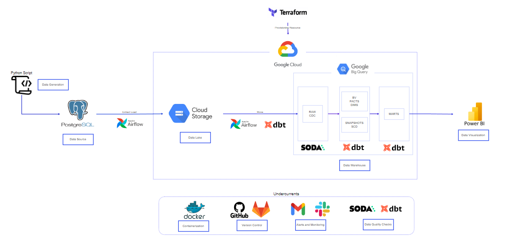

# Project Infrastructure

## Prerequisites
1. Docker installed - https://docs.docker.com/engine/install/
2. Postgres installed - https://www.postgresql.org/download/
3. Terraform installed - https://developer.hashicorp.com/terraform/tutorials/aws-get-started/install-cli
4. VSCode installed - https://code.visualstudio.com/download
5. GCP account with billing enabled

## Tools

1. Postgres (Data Source)
2. Airflow (Orchestration)
3. Docker (Containerization)
4. DBT (Data Transformation)
5. SODA (Data Quality)
6. Terraform (Infrastructure as Code)
7. Google Cloud Storage (Data Lake)
8. BigQuery (Data Warehouse)
9. Gmail (Alerts)

## Setup

1. Postgres sample data

    1.1. Download the data from https://www.postgresqltutorial.com/postgresql-getting-started/postgresql-sample-database/ and extract it (unzip)

    1.2. Create a database called dvdrental
    - Open the command line
    - Navigate to PostgreSQL's bin directory
        - `cd C:\Program Files\PostgreSQL\{version}\bin`
    - Run 
        - `createdb -U postgres dvdrental`

    1.3. Restore the data into the database
    - Make sure PATH is set for PostgreSQL Tools - https://www.commandprompt.com/education/how-to-set-windows-path-for-postgres-tools/
    - Run
        - `pg_restore -c -U postgres -d dvdrental -v "C:\{path to extracted tar file}\dvdrental.tar"`

2. Airflow with docker

    2.1. Download the docker-compose file
    - Open the command line
    - Navigate to the directory where you want to store the docker-compose file
    - Run
        - `curl -LfO -k "https://airflow.apache.org/docs/apache-airflow/2.8.0/docker-compose.yaml"`
    - Add these lines under x-airflow-common->volumes
        - `- ${AIRFLOW_PROJ_DIR:-.}/data:/opt/airflow/data`
        - `- ${AIRFLOW_PROJ_DIR:-.}/keys:/opt/airflow/keys`
        - `- ./config/airflow.cfg:/opt/airflow/airflow.cfg`
        - `- ./dvdrental_dbt:/dbt`
        - `- ./dvdrental_soda:/soda`

    2.2. Create new folders in the same directory
    - config
    - dags
    - data
    - keys
    - logs
    - plugins

    2.3. Populate the config folder
    - airflow-connections.yaml (see .example)
    - airflow.cfg (see .example)

    2.4. Useful docker commands
    - `docker-compose up -d` - start the containers
    - `docker-compose down` - stop the containers
    - `docker-compose ps` - list the containers
    - `docker-compose logs -f` - show the logs
    - `docker exec -it demo-dbt-airflow-gcp-airflow-webserver-1 bash` - connect to the container

    2.5. Add connection in Airflow
    - Run
        - `docker exec -it demo-dbt-airflow-gcp-airflow-webserver-1 bash -c "airflow connections import /opt/airflow/config/airflow-connections.yaml"`

    2.6. Populate the dags folder (eg. in dags/dvd_rental folder)

3. Deploy GCP resources with terraform

    3.1. Go to your GCP console and create a new project (e.g. dvdrental-avinity)

    3.2. Create service account
    - Go to IAM & Admin -> Service Accounts
    - Click on Create Service Account
    - Enter a name (e.g. dvdrental_avinity)
    - Click on Create -> Select a role and choose Project (GCS and Bigquery)
    - Click on Continue -> Done
    - Click on the newly created service account
    - Click on Keys -> Add Key -> Create new key
    - Choose JSON and click on Create
    - Save the file in the keys folder created in step 2.2 (see .example)

    3.3 GCS and Bigquery
    - Enable billing for the project to be able to create buckets in GCS
    - Enable BigQuery API

    3.4 Terraform
    - Create new folder - terraform
    - Navigate to the terraform directory
    - Create terraform configuration file (e.g. main.tf)
    - Create terraform variables file to store all the variables (see .example)
    - Open the terminal and run
        - `terraform init` - initialize the terraform
        - `terraform plan` - check if everything is ok
        - `terraform apply` - create the resources
    - Other useful commands
        - `terraform destroy` - destroy the resources
        - `terraform taint` - destroy and recreate resources during the next apply

4. DBT

    4.1 Install dbt (create a virtual environment beforehand)
    - Open terminal and run
        - `pip install dbt-core`
        - `pip install dbt-bigquery`

    4.2 Create a dbt project
    - Create profiles.yml file (see .example)
    - Run
        - `dbt init --profile {profile name in yml file}` - initialize the dbt project
    - Move profiles.yml and .user.yml file to the created dbt folder (eg. dvdrental_dbt)

    4.3 Additional configuration
    - Add custom_schema_macro.sql to the macros folder
    - Populate packages needed in the packages.yml file and run
        - `dbt deps` - install the packages
        - `docker exec -it demo-dbt-airflow-gcp-airflow-webserver-1 bash -c "cd /dbt && dbt deps"` - install the packages in the container

    4.4 Populate the models folder (eg. in bv, publiv and raw_dvdrental folders) and update dbt_project.yml file
    
    4.5 Useful dbt commands
    - `dbt debug` - check if the connection to the database is working
    - `dbt run` - run all the models
    - `dbt test` - run all the tests
    - `dbt docs generate` - generate documentation
    - `dbt docs serve` - serve documentation

5. SODA

    5.1 Install soda
    - Open terminal and run
        - `pip install soda-core-postgres`
        - `pip install soda-core-bigquery`

    5.2 Create a soda project
    - Create soda configuration file (see .example)
    - Create soda checks file - https://docs.soda.io/soda-cl/soda-cl-overview.html

    5.3 Useful soda commands
    - `soda test-connection -d {connection name} -c configuration.yml` - check if the connection to the database is working
    - `soda scan -d {connection name} -c configuration.yml {check file name}` - run the check

    
6. SMTP (Simple Mail Transfer Protocol) with Gmail

    6.1 Create app password - https://support.google.com/accounts/answer/185833

    6.2 Copy the password and paste it in the airflow.cfg file (see .example)
    - Update smtp_user and smtp_password
    

        

